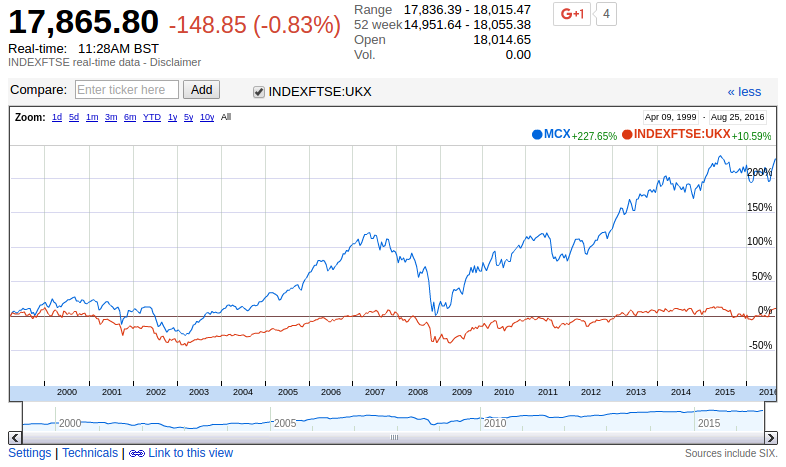

IS the FTSE 250 allways a better bet than the FTSE 100?

Historically, it seems to have always outperformed the FTSE 100 index. Look at this comparison below over the last 17 years. The FTSE 250 has returned about 250% whereas the FTSE 100 has gained not very much at all.

Further if I compare any 5 year period over this time the FTSE 250 always seems to come out better!

Is this pattern set to continue? What do you reckon?

_Try it yourself on Google Finance by setting the view to 5 years and then dragging the slider along the bottom to any point since 1999_

_https://www.google.com/finance?q=INDEXFTSE%3AMCX&ei=S8e-V9mAEoWO0ASn66PgAQ_

_(you'll need to add the FTSE 100 index - INDEXFTSE:UKX)_

 

**This article offers some explanations**

**http://moneyweek.com/ftse-100-v-ftse-250-why-have-they-diverged-by-so-much/**
