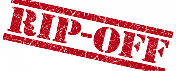

!

Recently the Murray Report found that Australian’s are paying double the fees of other Western 
countries for their retirement. 
That’s costing us $20 billion dollars each year, or an average of $1100 each!

<!-- more -->

Why are Aussies being so badly ripped off? Well we could blame the funds for slugging consumers with hidden high fees and bamboozling them with complicated 100 page fund guide booklets but honestly, consumers’ apathy is resulting in them being taken for a ride. Most people simply accept their employer’s fund and never get round to checking how their fund compares. Maybe this is a consequence of the super guarantee system - quietly deducting 9.5% from your wages before you notice, squirreling it away out of sight and out of mind.

The scary thing is how much can be lost. For instance, each 1% lost from the return reduces the balance by about 20% over 30 years. The compounding effect of fees is a non intuitive concept that the human brain finds hard to grasp.

The truth is that superannuation is probably your biggest asset (after your house), yet I’m willing to bet how rarely people read their statement in detail let alone compare its performance with other funds.

Not all funds are created equal. Two camps have emerged - firstly the traditional retail funds from the likes of the big four banks and insurers and secondly, the newer [industry funds](http://www.industrysuper.com/) created by industry bodies.

Industry funds are the superheroes of the superannuation industry. They bravely put their members before themselves, unlike the shady retail funds which prioritise company profit over growing their customer’s life savings.

Retail funds tend to have high fees and lower performance, whereas industry funds are generally not for profit and pay no commission so they are generally cheaper, equalling better performance.

Superratings found that in the 10 years to 2013 the difference in performance between industry funds and retail funds has been 1.89% (_SuperRatings Fund Crediting Rate Survey – SR50 Balanced Option – Median Returns (December 31, 2013))._

Now 1.89% might not sound like a lot, but believe me it sure adds up over the years. Here’s an example of just how much of a difference that 1.89% can make. Prepare to be shocked.

Meet Dave, he started working at age 20 and was put into his company's retail super scheme, retiring at age 65. Lets assume he earned an average salary of $80,000 throughout his career.

 

**At retirement Dave will have:**

A balance in his retail fund of **$1,362,212.** Not bad you say, but wait - this would have been his balance had he been with the average industry fund:  **$2,248,762.** Thats a whopping difference of **$886,550** he has lost out on!

So almost **40%** of Dave’s total lifetime contribution has gone bye-byes, never to be seen again!  Would Dave ever have realised this at retirement? Probably not and besides, it’s too late.

The trouble is most people never get to see this side of the story. Your superannuation statement never adds up all the compounded fees and commissions or tells you what these would have amounted to should they have remained invested in your fund.

If they did it might go something like this:

 

```
Dear Mr Smith,

Congratulations on working hard for 47 years. We are pleased to say that you have $1,362,212 in super for your retirement.

However we regret to inform you that our fees, commissions and poor performance have resulted in a yearly 1.89% cost, 
which has deprived your fund of a total of $886,550 whilst you have faithfully been investing with us throughout your working life. 
We hope you don’t mind that this is almost 40% of your nest egg and trust that you won’t miss it too much.

Thanks again for being such a great customer and so generously paying for my big beachside house.

Best of luck in your old age

Your Fund Manager


P.S. We would have told you earlier about the effects of our fees but you never once contacted us to check, so naturally we thought you weren’t really interested.

P.P.S. And thanks so much for not asking our advisors for advice, which you have been paying for all this time. That’s jolly nice of you not to bother us.
```

 

It does not have to be like this. The good news is most of you are free to switch to whatever fund you choose, and there are some standout low cost funds out there. With a hour or two’s effort you could save yourself hundreds of thousands of dollars which could make all the difference to you and your family’s retirement.

Don’t suffer like Dave and don’t let them get away with it. Start asking questions, take an interest and take control.

Not sure where to start? The author of this post has produced a valuable report designed to educate Aussies in how to make the most of their superannuation. They’ve done the leg work and found a real knockout fund, which has the lowest fees in the industry.
