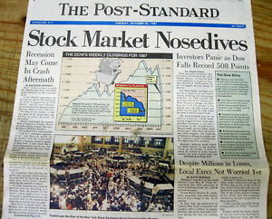

- 

This is the headline news papers should really have on the front page.  

<!-- more -->

Instead it’s things like this:  

> _“Crash! Share market falls of a cliff, $50 billion lost”_  
> 
> _“Share market loses $41 billion as market drops to two-year low”_  
> 
> _“$50 billion wiped off share market, worst result since Brexit”_  
> 
> _“Why the stock market plunged Monday”_

Oh no!, run for the hills, the end is nigh!  

Of course news has to sell and sensationalist news sells more, especially when it induces a bit of fear. “If it bleeds, it leads” is the old adage. Headlines like “Over the last 100 years the share market has beat any other class of investment hands down, despite numerous crashes”, just won’t appear as they don’t have the immediate impact.  

What worries me is that this prevents a lot (most) people learning about how the share market works. How, over the short term volatility is to be expected, but this is not to be confused with risk. How, over the long term returns are increasingly positive the more patient you are. The miracle of compounding is not an intuitive concept to the human mind.  

In fact, it’s this irrational fear that keeps folks invested in nothing but cash, without realising the actual risk comes from inflation, and the slow erosion of your wealth.  

Be brave, step up, learn how the share market works, wonders await!  

I recommend becoming a member of the Motley Fool (US, UK and Australia) and The Barefoot Investor (Australia)
