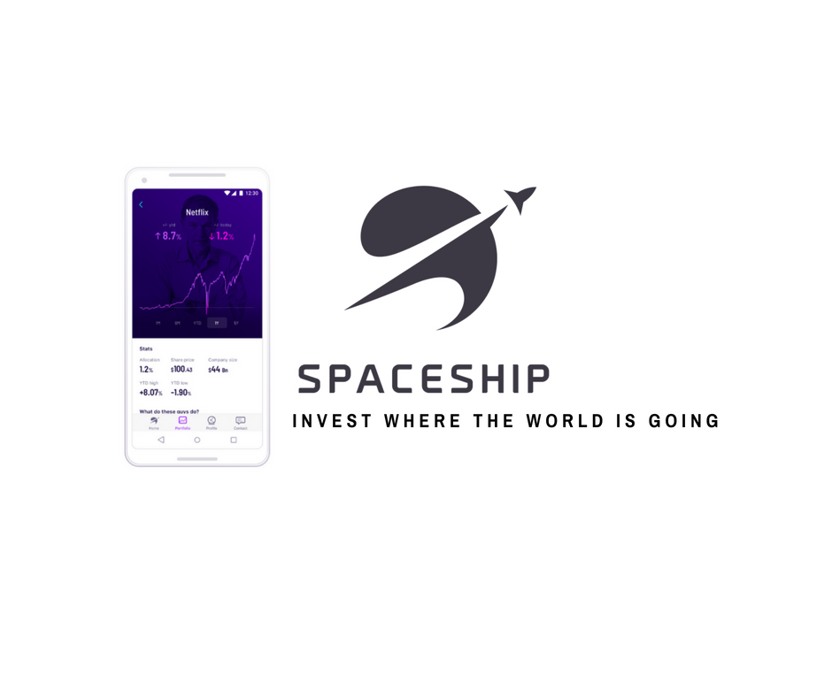

- 

I’ve recently signed up for Spaceship’s Voyager investing application and so far I’m refreshingly surprised by how good a deal it is. Signing up was quick, but I did have some trouble logging in and changing my password :-(. And why do i have to use my mobile to create an account? Can’t I sign up by using my laptop and use it’s nice keyboard to enter my details?

Overall Voyager seems like a really accessible way for anyone to get started investing with even small amounts.

Here are some of the things I like:

- **Zero fees:** under $5000 balance
- **Low fees:** 0.05% annual fee for index fund option or 0.10% annual fee for managed fund
- **Zero transaction costs:**
    - No minimum balance
    - No brokerage fees!
    - No Buy-sell spreads
    - No entry or exit fees
- **Well diversified outside of Australia**
    - Overseas 70-80%
    - Australia 15-25%
    - Cash 0-10%

This article does a great job of [comparing Voyager with other robo investment options](https://medium.com/@theemuofsydney/an-analysis-of-spaceship-voyager-abbae4b6eb23) in Australia:

It's just a shame that Spaceship's Super fund options don't also offer these low fees :-(

https://www.spaceshipinvest.com.au/
