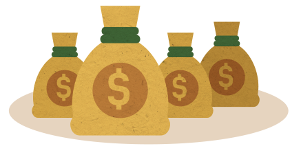

# Are you being screwed by your retirement fund?

# Sit down, we have some really bad news for you.

We hate to say it, but you probably **ARE** being screwed by your retirement account.

How do you know? Well ask yourself this one question:

 

## What fees am I paying?

 

If you can't answer this question then you're not alone. The average worker is being stung by fees and doesn't even know it.

So how much are we talking here?

Image of 30 year old Brett at work

# Lets use Brett as an example

Brett is a hard working **30** year old plumber. He earns an average salary of **$60,000** per year and his retirement account charges him **1.2% in fees**. (The average Aussies pay in fees)

**Only 1.2%** - seems like a pretty small amount doesn't it? Well no, actually. That **1.2%** taken each and every year from the entire balance of this fund will amount to a shocking sum by retirement. He does not know it yet, but by the time he retires he will have lost

## $286,294

from his fund due to fees.

That amounts to over a **quarter** of his nest egg gone bye-byes FOREVER!

# $286,294 lost!

 

So how come a small % fee takes so much?

# Fees are the enemy

A study conducted by the the Grattan Institute shows that

_A fee of 1.5 per cent will erode 30 per cent of a fund’s retirement balance over 40 years, while a 1 per cent fee will erode more than 20 per cent of a retirement nest egg over the same period._

The fees are charged as a percentage on your **entire balance.** This means the bigger your fund the more you will pay in fees. As you near retirement your retirement fund balance is at it's peak, just at the time you need your money the fees are also taking their biggest bite out of your life savings.

Also this percentage fee is charged no matter how well you fund performs. The fund manager will happily take their fee even when your fund makes a loss for the year!

The biggest loss from fees is the lost investment that would have otherwise stayed in your retirement pot and been allowed to compound. Over your lifetime this adds up to a huge chunk of your savings you are missing out on.

## What can you do about it?

**Basically it all comes down to the fees you pay. In the case of retirement savings, the lower the fees the better.**

By switching to a low cost retirement fund you could end up having over a **quarter of a million $'s** more in retirement!

What would you do with a quarter of a million $'s?

# Switch and have

# $264,645

# more in retirement

Below we show what % you will have left in your retirement account at retirement after the cost of fees have taken their bite.

We compare your typical fund with our equivalent recommended low cost fund.

Our recommended low cost retirement fund

We've spent many hours comparing the best balanced superannuation funds available in Australia\* and have identified the best low cost balanced fund.

_We’ve even found the exact fund option you should invest in (and it's not the default option)_  

_\*80% of Australians are invested in the default balanced option within their superannuation fund. 
If you don't know, then you're probably in the default balanced choice_

We are not affiliated with any super fund and we do not receive commission or kickbacks from any financial institutions.

At Bald Money we pride ourselves on putting you first, not being biased by companies trying to flog you stuff. 
Don't get ripped off!

See our [Recommended Super Fund](best-super-fund)

## You can save yourself $100,000s!
