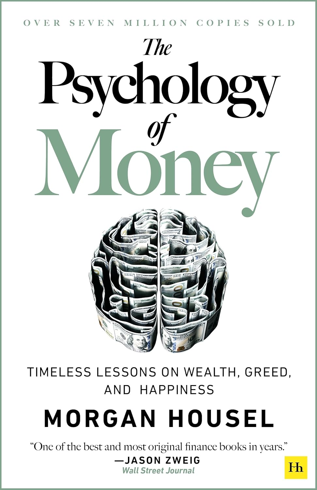

# Resources

Here are some of my favourite books about personal finance, investing, and money management.

!!! Info inline end ""

    

    ??? Info "Commission earned on links"

        The links to Amazon.com on this page are referal links. If you click on them and make a purchase, 
        I will earn a small commission. This helps me to keep the site running and continue to provide free content. 
        Thank you for your support!

## Your Money or Your Life - Vicki Robin, 1992
This book changed my life. It introduced me to the concept of being able to live of your investments once 
they reach a certain amount to generate income sufficient for your personal requirements. I discovered the concept of
financial independence from this book. 

One of the key concepts is the idea of 'life energy'. 
When you work, you trade your life energy for money. Hours of your mental and physical effort is 'stored' as money. 
You then trade in this money for food, clothing, shelter, etc to get more life energy. 

Why would you want to waste you life energy?

----

!!! Info inline end ""

    

    ??? Info "Commission earned on links"

        The links to Amazon.com on this page are referal links. If you click on them and make a purchase, 
        I will earn a small commission. This helps me to keep the site running and continue to provide free content. 
        Thank you for your support!

## The Psychology of Money - Morgan Housel 2020
Morgan Housel does a wonderful job of explaining why investing is not like the hard science subjects of physics 
or engineering, it's an area where soft skills are much more important. 

Not being too greedy, knowing when you have enough, having humility over desiring status. 

Investors are humans and all humans have emotions, it is therefore impossible to apply rational thinking to peoples 
decisions about money and the stock market.

Key takeaways include:

* Wealth is relative: True wealth is not just about accumulating assets, but also about finding contentment and 
fulfillment in your current circumstances.
* Time is your most valuable asset: Compounding returns over time are crucial for long-term wealth building.
* Risk and reward are intertwined: Accepting risk is essential for achieving significant financial goals, 
but it's important to understand and manage that risk effectively.
* Your story matters: Your personal experiences, beliefs, and biases significantly influence your financial decisions.

----

!!! Info inline end ""

    

    ??? Info "Commission earned on links"

        The links to Amazon.com on this page are referal links. If you click on them and make a purchase, 
        I will earn a small commission. This helps me to keep the site running and continue to provide free content. 
        Thank you for your support!

## The Millionaire Next Door - Thomas J. Stanley, 1996
Debunks the myth of the "flashy millionaire" and instead reveals that true wealth is often built through frugality, 
discipline, habit, and a long-term focus on financial independence.

Stanley's research, based on extensive interviews with high-net-worth individuals, provides a fascinating look into 
the lifestyles and habits of the truly wealthy. 

Key takeaways include:

* Wealth is built gradually: Most millionaires accumulate wealth through consistent saving and investing over time, 
rather than through sudden windfalls or risky ventures.
* Frugality is key: High-net-worth individuals often live below their means, prioritizing saving and investing over 
conspicuous consumption.
* Many millionaires are continuously learning about money and finances, in fact they are often self-taught investors
who take an active interest in managing their own money rather than relying on financial advisors with questionable 
incentives.

----

!!! Info inline end ""

    

    ??? Info "Commission earned on links"

        The links to Amazon.com on this page are referal links. If you click on them and make a purchase, 
        I will earn a small commission. This helps me to keep the site running and continue to provide free content. 
        Thank you for your support!

## The Simple Path to Wealth - J.L. Collins 2016
This book started as a series of letters written by the author to his daughter on how to be good with money. In an interview
I heard recently, J.L. Collins admitted that originally his daughter had mostly ignored his advice but more recently had
started taking the financial advice on board.

This book sets out wonderfully simple, straight forward money advice in an easy to understand style. Passive investing using
ETFs. 

The author is based in the US, but his advice can easily be applied to those irrespective of home country.

----

!!! Info inline end ""

    

    ??? Info "Commission earned on links"

        The links to Amazon.com on this page are referal links. If you click on them and make a purchase, 
        I will earn a small commission. This helps me to keep the site running and continue to provide free content. 
        Thank you for your support!

## Poor Charlie's Almanack - Charles T. Munger 
Timeless wit and wisdom from Warren Buffet's long time business partner and friend. 

I especially like the quote "A one-legged man in an ass kicking contest" - if you're competing in an area where everyone has two legs, you're at a 
significant disadvantage.

Munger suggests that investors should focus on finding areas where they have an edge. This could be through deep 
industry knowledge, a unique skillset, or access to exclusive information.
Focus on areas where you have a competitive advantage to increase your chances of success.
